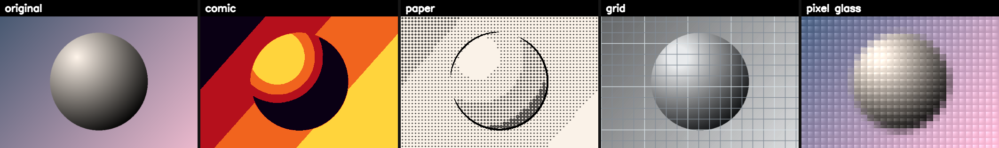

# 🎬 Hand Frame FX – Real-Time Hand-Tracked Stylization

A captivating **real-time computer vision project** that uses hand gesture tracking to apply stunning artistic effects to video. Bring two hands close together to cycle through 4 bold, share-worthy visual styles while recording your performance.



---

## ✨ Features

### 🎨 Four Stunning Effects
- **Comic** – Bold pop-art posterization in red, orange, and yellow
- **Paper** – Ink outline on dotted stipple paper (pencil-sketch look)
- **Grid** – Greyscale subject under a crisp technical blueprint grid
- **Pixel Glass** – Vibrant frosted glass tiles with glossy highlights

### 🖐️ Intuitive Hand Gesture Control
- **Two-hand proximity detection** – Bring hands close together to cycle effects
- **Smooth tracking** – Intelligent smoothing prevents jittery selection
- **Permissive pose detection** – Open palms, pinched hands, L-shapes all work
- **Real-time processing** – 30 FPS performance on modern hardware

### 🎥 Recording & Preview
- **Live video recording** – Capture your FX performances in MP4 or AVI
- **Real-time speed playback** – Videos play at true wall-clock speed regardless of processing rate
- **FPS display** – On-screen performance monitoring
- **Clean output** – Recording captures the composited frame without UI overlays

### 🔧 Performance Optimized
- **Capped effect resolution** – Dynamic scaling keeps FPS stable even with large regions
- **Efficient hand detection** – Lightweight MediaPipe model runs at half-scale
- **Vectorized effects** – Color gradients, pixel operations, and image processing fully optimized

---

## 📋 Requirements

- **Python 3.8+**
- **OpenCV** (`cv2`)
- **NumPy**
- **MediaPipe** (hand tracking)
- **Webcam** or video source

### Install Dependencies

```bash
pip install opencv-python numpy mediapipe
```

---

## 🚀 Quick Start

### 1. **Live Hand-Tracked Effects**

Run the main application with your webcam:

```bash
python hand_frame_fx.py
```

**Controls:**
| Key | Action |
|-----|--------|
| `q` | Quit |
| `spacebar` | Next effect |
| `l` | Toggle hand skeleton overlay |
| `r` | Record / stop recording |
| Bring hands together | Cycle effects automatically |

### 2. **Generate Effect Samples**

Create a contact sheet showing all effects applied to a test scene:

```bash
# Generate from the built-in demo scene
python make_contact.py

# Or use your own image
python make_contact.py /path/to/image.jpg

# Or capture a live frame from your webcam
python make_contact.py cam
```

This creates `effects_contact_sheet.png` showing the original + all 4 effects side-by-side.

---

## 🎯 How It Works

### Hand Detection & Gesture Tracking
- **MediaPipe Hands** detects hand landmarks in real-time
- **Dual-hand proximity** measured in hand-widths (scale-invariant)
- **Index & thumb tips** define the tracking region
- **Convex hull** creates the effect mask

### Effect Pipeline
1. Extract patch from hand-tracked region
2. Apply chosen effect with dynamic resolution capping
3. Blend processed patch back into frame using convex mask
4. Compose with UI overlays (FPS, REC badge)
5. Write to video file (if recording)

### Visual Effects Deep Dive
- **Comic** – Histogram equalization + 4-level posterization with vibrant gradient lookup table
- **Paper** – Adaptive thresholding for ink outline + dotted stipple shading based on luminance
- **Grid** – Greyscale with brightness boost + vectorized grid overlay (major/minor lines)
- **Pixel Glass** – Frosted blur + saturation boost + pixelated tiles + per-tile glassy highlight

---

## 📁 Project Structure

```
open_cv-project/
├── hand_frame_fx.py          # Main application (live FX + recording)
├── make_contact.py           # Effect sampler (generates contact sheet)
├── effects_contact_sheet.png # Sample output showing all 4 effects
└── README.md                 # This file
```

### `hand_frame_fx.py`
Core module with:
- **Effect functions** – `fx_comic()`, `fx_paper()`, `fx_grid()`, `fx_pixel_glass()`
- **Color utilities** – Gradient LUT builder for smooth color interpolation
- **Hand tracking** – Gesture detection and smoothing
- **Recording** – `VideoWriter` integration with real-time speed sync
- **Main loop** – Multi-hand processing, effect cycling, UI rendering

### `make_contact.py`
Utility script to showcase all effects:
- `demo_scene()` – Renders a tonally rich synthetic scene (sphere on gradient)
- `get_source()` – Loads image, video file, or webcam frame
- `main()` – Applies all effects and stitches into a contact sheet grid

---

## 🎬 Recording Tips

- **Bring hands closer** to trigger effect changes mid-performance
- **Larger hand regions** = more dramatic effect appearance (move closer to camera)
- **Stable lighting** improves hand detection confidence
- **Videos auto-save** with timestamp: `hand_frame_fx_YYYYMMDD_HHMMSS.mp4`

---

## ⚙️ Tuning Parameters

In `hand_frame_fx.py`, adjust these constants for different behavior:

```python
DETECT_SCALE = 0.5      # Detection resolution (lower = faster but less accurate)
SMOOTH = 0.55           # Corner smoothing (0.0=very smooth, 1.0=instant)
NEAR_ON = 1.5           # Hand proximity to trigger effect change (hand-widths)
NEAR_OFF = 2.6          # Hand spread distance to re-arm
HOLD_FRAMES = 5         # Frames to hold shape during detection dropout
CHANGE_COOLDOWN = 5     # Min frames between filter changes
FX_MAX_DIM = 420        # Cap effect working resolution (pixels)
REC_FPS = 30            # Playback frame rate for recorded video
```

---

## 💡 Creative Ideas

- 🎭 Create a **multi-effect performance** – cycle through all 4 looks in one take
- 📸 **Snapshot mode** – press spacebar to freeze and swap effects
- 🎨 **Mask experiments** – try different hand poses to create shapes
- 🎥 **Montage** – record multiple short clips and edit them together
- 🖼️ **Still frames** – use `make_contact.py` to batch-process images

---

## 🔍 Technical Highlights

- **Efficient color mapping** – Pre-computed LUTs for fast gradient interpolation
- **Adaptive thresholding** – Paper effect uses local contrast for ink detection
- **Texture synthesis** – Pixel glass highlights use outer-product tiling
- **Exponential moving average** – FPS counter smoothing
- **Convex hull masking** – Clean blending at effect boundaries
- **Dynamic resolution scaling** – Effects maintain stable FPS on large quads

---

## 📜 License

This project is licensed under the **MIT License** – see the [LICENSE](LICENSE) file for details.

---

## 🤝 Contributing

Found a bug? Have a cool effect idea? Submit an issue or pull request!

---

## 🎉 Have Fun!

Experiment with hand gestures, record yourself, share your creations, and push the boundaries of real-time computer vision. Enjoy! 🚀

---

**Made with ❤️ by [@meddadaek](https://github.com/meddadaek)**
